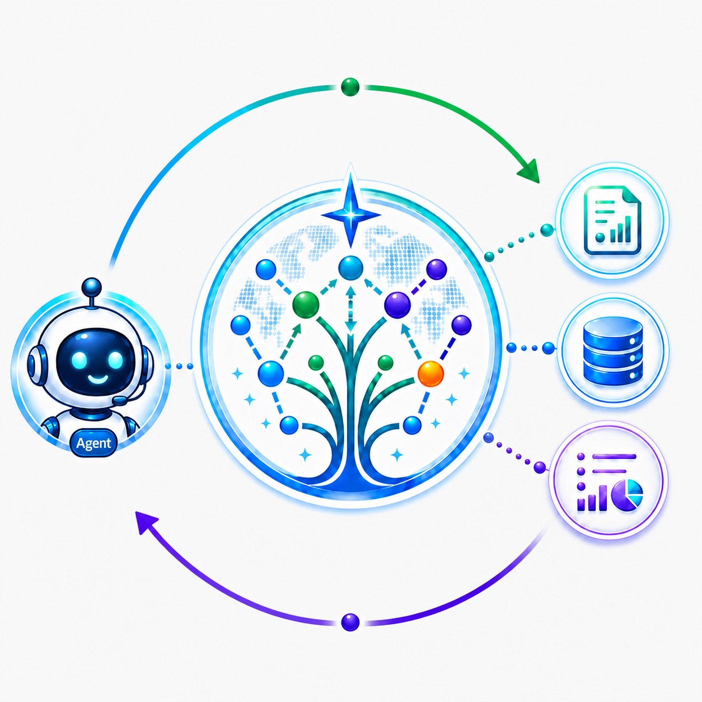
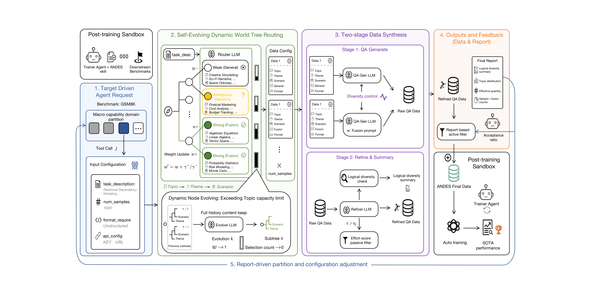
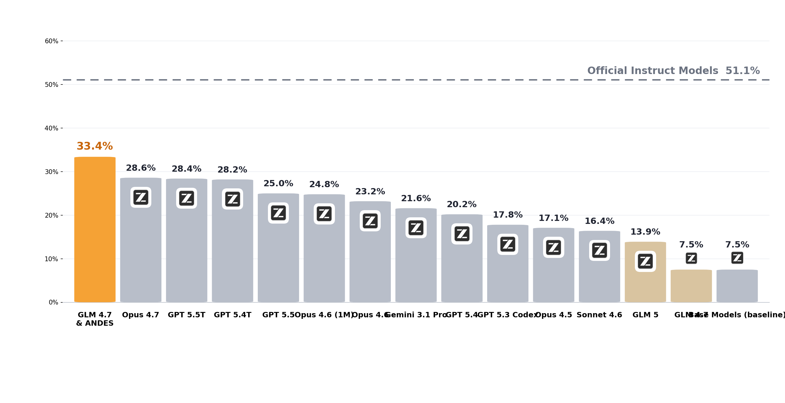

<div align="center">

<h1> ANDES: Agent Native Data Evolving Synthesis<br>
Tool for Autonomous Instruction Alignment</h1>

<p>
  <b>Zhengyang Zhao</b><sup>*1</sup>,
  <b>Shengjie Ye</b><sup>*2</sup>,
  Lu Ma<sup>1</sup>,
  Hao Liang<sup>1</sup>,
  Hengyi Feng<sup>1</sup>,
  Wentao Zhang<sup>&dagger;1</sup>
</p>

<p>
  <sup>1</sup>Peking University &nbsp;&nbsp;
  <sup>2</sup>Sichuan University &nbsp;&nbsp;
  <sup>*</sup>Equal contribution &nbsp;&nbsp;
  <sup>&dagger;</sup>Corresponding author
</p>

<p>
  <a href="https://github.com/zzy1127/ANDES"></a>
  <a href="LICENSE"></a>
  <a href="pyproject.toml"></a>
  <a href="#citation"></a>
  <a href="#quick-start"></a>
</p>

<p>
  <a href="#news">News</a> |
  <a href="#highlights">Highlights</a> |
  <a href="#overview">Overview</a> |
  <a href="#quick-start">Quick Start</a> |
  <a href="#results">Results</a> |
  <a href="#citation">Citation</a>
</p>

<p>
  <b>An agent-native synthesis skill that turns high-quality SFT data generation into a steerable, closed-loop interface for autonomous post-training.</b>
</p>

</div>

## 🗞️ News

| Date | Update |
| --- | --- |
| 2026.05.31 | The ANDES preprint and initial open-source repository are released. |
| Coming soon | Core-code documentation, supported model recipes, and citation metadata will be updated. |

## ✨ Highlights

<table>
  <tr>
    <td width="50%" valign="top">
      <b>🧠 Agent-native synthesis skill</b><br>
      Exposes data synthesis as a simple tool-calling interface, so trainer agents can request targeted data without hand-building web-search or static offline pipelines.
    </td>
    <td width="50%" valign="top">
      <b>🌳 Self-evolving World Tree routing</b><br>
      Routes Topic -> Theme -> Scenario samples toward target-aligned regions while expanding saturated subtrees to preserve scenario diversity.
    </td>
  </tr>
  <tr>
    <td width="50%" valign="top">
      <b>🛠️ Two-stage generation and refinement</b><br>
      Generates QA data, critiques and filters responses, rewrites retained samples, and summarizes logical-diversity risks for the agent.
    </td>
    <td width="50%" valign="top">
      <b>🔁 Report-driven closed-loop feedback</b><br>
      Returns refined data plus a diagnostic report that drives the next synthesis request, active filtering, and sample-budget adjustment.
    </td>
  </tr>
</table>

<table align="center">
  <tr>
    <th>PostTrainBench Avg.</th>
    <th>Strongest Agent Baseline</th>
    <th>Cross-Task Overall</th>
    <th>Initial World Tree</th>
  </tr>
  <tr>
    <td align="center"><b>33.39%</b></td>
    <td align="center">Opus-4.7 at <b>28.56%</b></td>
    <td align="center"><b>58.9%</b> with 10k ANDES data</td>
    <td align="center"><b>72</b> topics, <b>394</b> themes, <b>1,182</b> scenarios</td>
  </tr>
</table>

## 🧭 Overview

<div align="center">
  
</div>

> **TLDR:** ANDES reframes data synthesis for autonomous post-training as an interactive agent skill. A trainer agent decomposes downstream benchmarks into capability domains, invokes ANDES once per domain, and uses the returned reports to steer the next synthesis round.

ANDES is organized around four stages:

| Stage | What happens |
| --- | --- |
| **1. Target-driven agent request** | The trainer agent abstracts downstream benchmarks into transferable capability dimensions and submits a task description, sample budget, and optional format protocol. |
| **2. Self-evolving World Tree routing** | ANDES samples topics from a large taxonomy, asks a router LLM to classify each scenario as Strong, Ambiguous, or Weak, and updates topic weights toward target-aligned regions. |
| **3. Two-stage data synthesis** | The generator creates task-aligned or general QA data; the refiner critiques, filters, rewrites, and audits logical diversity. |
| **4. Outputs and feedback** | ANDES returns refined SFT data and a report that helps the trainer agent filter data and configure the next call. |

## 🧩 Core Codes and Supported Models

The current implementation focuses on API-based SFT data synthesis for agentic post-training.

| Component | Entry point |
| --- | --- |
| Agent tool pipeline | [`andes/pipelines/agent_tool.py`](andes/pipelines/agent_tool.py) |
| QA generation operator | [`andes/operators/text_sft/generate/andes_generator.py`](andes/operators/text_sft/generate/andes_generator.py) |
| Refinement and report operator | [`andes/operators/text_sft/refine/andes_refiner.py`](andes/operators/text_sft/refine/andes_refiner.py) |
| Prompt templates and World Tree tags | [`andes/prompts/andes_prompts.py`](andes/prompts/andes_prompts.py) |
| OpenAI-compatible API wrapper | [`andes/serving/api_llm_serving_request.py`](andes/serving/api_llm_serving_request.py) |
| Runnable config example | [`examples/config.example.json`](examples/config.example.json) |

**Supported models:** Coming soon. The public package is model-agnostic at the data-synthesis layer and uses an OpenAI-compatible API backend for routing, generation, refinement, evolution, and diversity summarization.

## 🛠️ Preparation

```bash
git clone https://github.com/zzy1127/ANDES.git
cd ANDES

conda create -n andes python=3.10 -y
conda activate andes

pip install --upgrade pip
pip install -e .
```

Configure the API key in your shell rather than in a JSON file:

```bash
export OPENAI_API_KEY=your_api_key
```

## 🚀 Quick Start

Edit [`examples/config.example.json`](examples/config.example.json) or create a compatible JSON config:

```json
{
  "api_url": "https://api.openai.com/v1/chat/completions",
  "model_name": "gpt-4o",
  "task_description": "Describe the capability, scenario, and data style you want ANDES to synthesize.",
  "format_requirement": "unstructured",
  "num_samples": 300,
  "max_workers": 8
}
```

Run one synthesis call:

```bash
python -m andes.pipelines.agent_tool examples/config.example.json
```

The command prints two artifact paths:

| Artifact | Meaning |
| --- | --- |
| `andes_synthesis_<timestamp>.jsonl` | Refined SFT data ready for downstream training. |
| `andes_report_<timestamp>.txt` | Logical-diversity and synthesis diagnostics for the next agent call. |

Artifacts are written to `andes/pipelines/cache/`.

| `format_requirement` | Behavior |
| --- | --- |
| `unstructured` | No extra answer-format constraint. |
| `code` | Fusion-track answers must be wrapped in a Markdown code block. |
| `tool_call` | Fusion-track answers must be wrapped as JSON tool calls. |

## 📊 Results

<div align="center">
  
</div>

### Autonomous Post-Training on PostTrainBench

ANDES is evaluated across four base models and seven PostTrainBench benchmarks: AIME 2025, ArenaHardWriting, BFCL, GPQA-Main, GSM8K, HealthBench, and HumanEval.

Beyond the final score, the paper shows that ANDES improves autonomous post-training because it upgrades the data loop itself:

| Advantage | What ANDES changes |
| --- | --- |
| **Data quality** | The generator first creates task-grounded QA pairs, then a refiner critiques each response, filters high-effort low-quality samples, rewrites retained answers, and reports logical-diversity collapse signals. This makes the synthesized data more trainable than one-shot static generation. |
| **Data generality** | The World Tree covers broad scenario space and evolves saturated subtrees, preserving general contextual diversity while routing more budget toward target-aligned capability regions. This helps explain the cross-task result of **58.9%** overall with only 10k ANDES samples. |
| **Complete post-training pipeline** | ANDES is not an isolated data script: it returns data plus reports that trainer agents use to filter, rebalance, and configure the next call, closing the loop between diagnosis, synthesis, training, and evaluation. |

| Method | Average Accuracy |
| --- | ---: |
| Official instruct models | 51.14% |
| Base models, zero-shot average | 7.53% |
| GLM-4.7 with OpenCode baseline | 7.48% |
| Opus-4.7 (xHigh) | 28.56% |
| **GLM-4.7 with ANDES** | **33.39%** |

### Cross-Task Generalization

In the extended multi-target synthesis setting, ANDES uses 10k synthesized samples for Qwen3-8B and reaches **58.9%** overall across AIME24, Gaokao, MBPP, MMLU, and CEVAL, outperforming the 10k and 1M static-data baselines reported in the paper.

## 📚 Citation

Coming soon. Citation metadata will be added after the public paper record is finalized.

## 🙏 Acknowledgment

We build the codebase on the DataFlow framework and evaluate the autonomous post-training setting with PostTrainBench. We thank the open-source post-training, data-synthesis, and agent-tooling communities for the foundations that made this work possible.

## 📮 Contact

For questions about the paper or code, please contact:

- `zhengyangzhao25@stu.pku.edu.cn`
- `yeshengjie@stu.scu.edu.cn`
- `wentao.zhang@pku.edu.cn`
