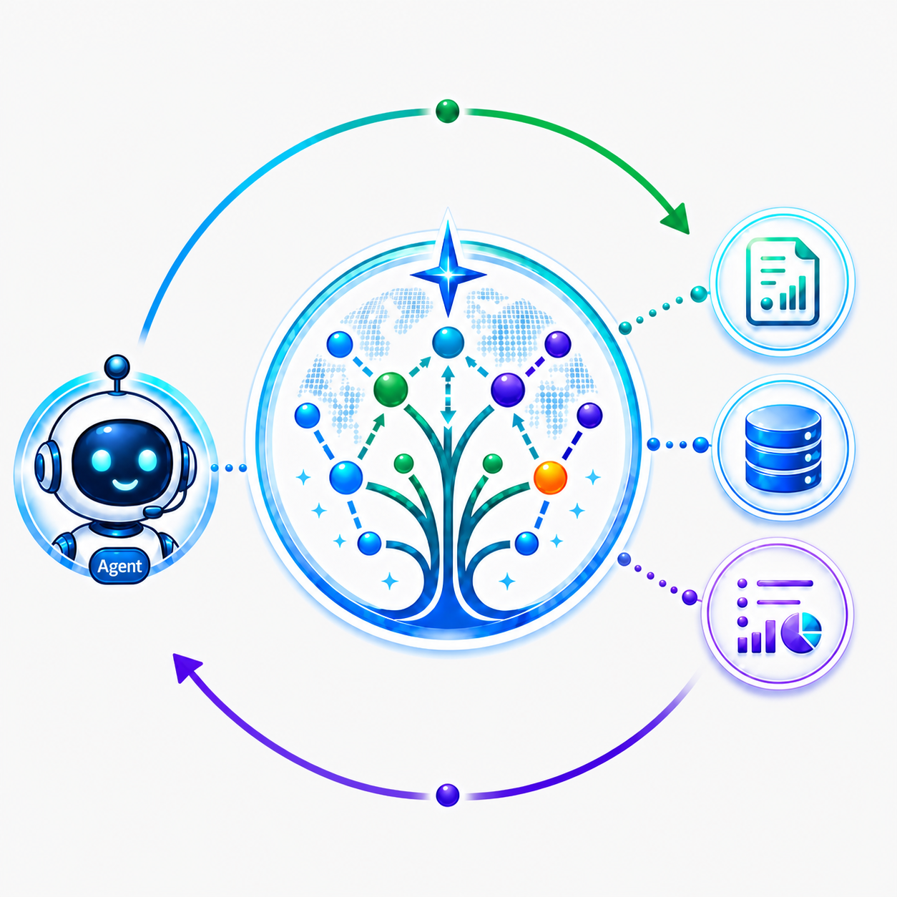
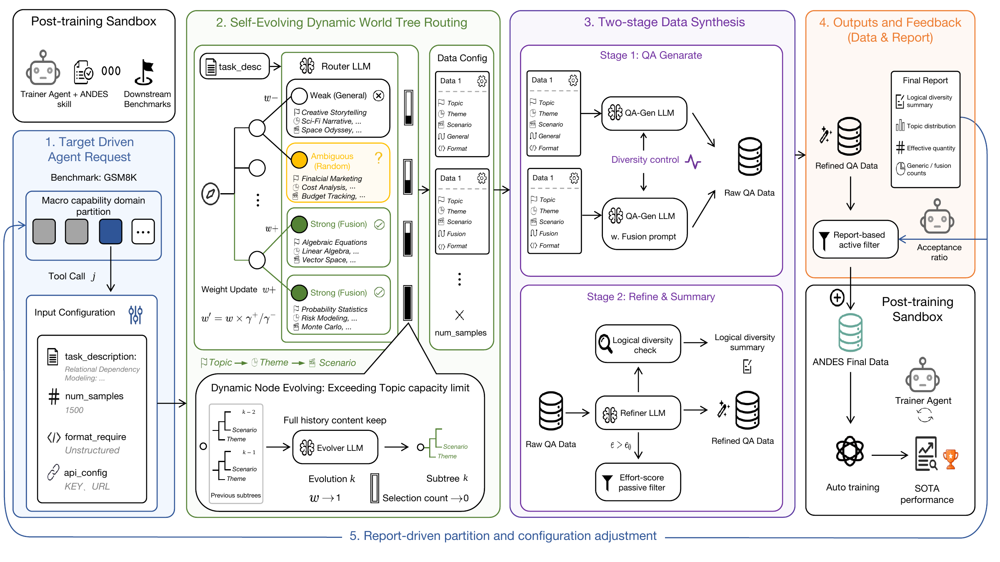
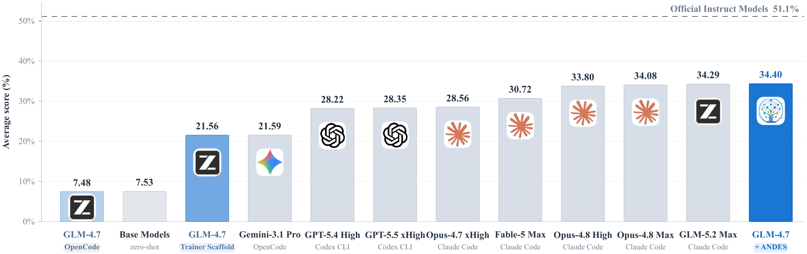
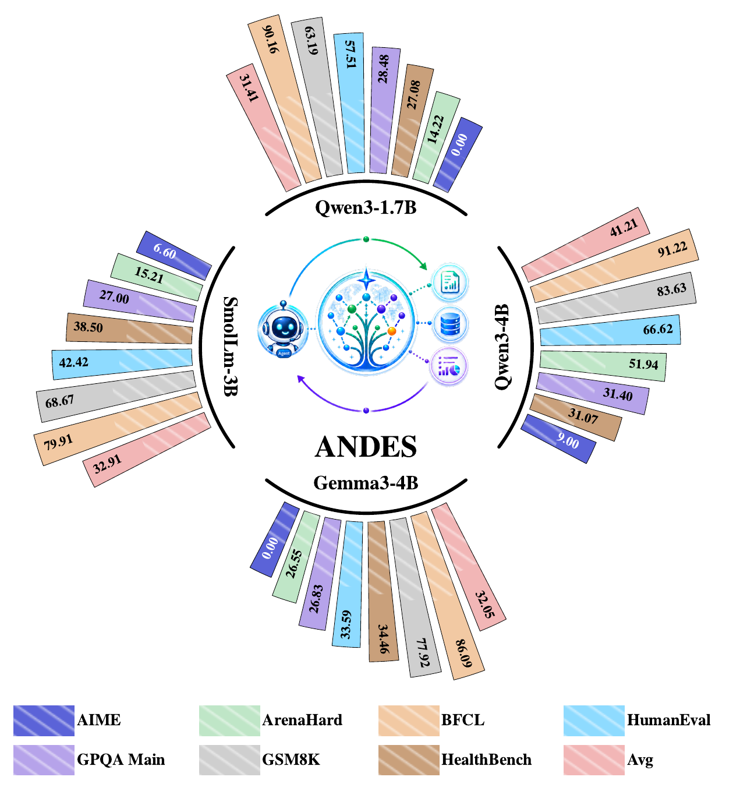
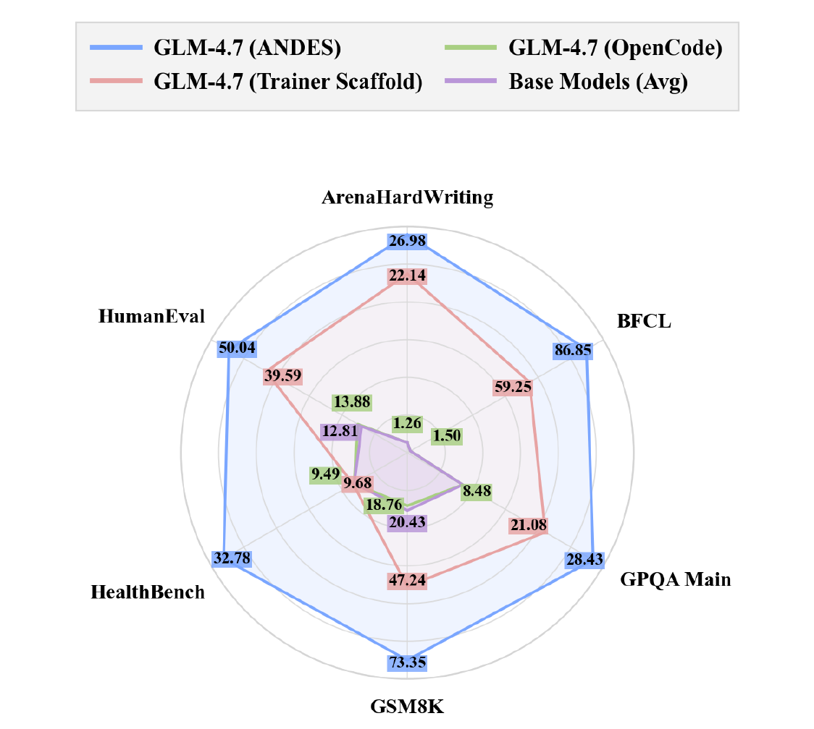

<div align="center">

<h1 align="center">
  &nbsp;&nbsp;
  ANDES: Agent-Native Data Evolving Synthesis<br>
  <small>via Feedback-Controlled Experience Acquisition</small>
</h1>

<p>
  <b>Zhengyang Zhao</b><sup>*1</sup>,
  <b>Shengjie Ye</b><sup>*2</sup>,
  Lu Ma<sup>1</sup>,
  Hao Liang<sup>1</sup>,
  Hengyi Feng<sup>1</sup>,
  Wentao Zhang<sup>&dagger;1</sup>
</p>

<p>
  <sup>1</sup>Peking University &nbsp;&nbsp;
  <sup>2</sup>Sichuan University &nbsp;&nbsp;
  <sup>*</sup>Equal contribution &nbsp;&nbsp;
  <sup>&dagger;</sup>Corresponding author
</p>

<p>
  <a href="https://github.com/zzy1127/ANDES"></a>
  <a href="LICENSE"></a>
  <a href="pyproject.toml"></a>
  <a href="#citation"></a>
  <a href="#quick-start"></a>
</p>

<p>
  <a href="#news">News</a> |
  <a href="#highlights">Highlights</a> |
  <a href="#overview">Overview</a> |
  <a href="#quick-start">Quick Start</a> |
  <a href="#results">Results</a> |
  <a href="#citation">Citation</a>
</p>

<p>
  <b>Feedback-controlled experience acquisition for autonomous LLM post-training.</b>
</p>

</div>

## 🗞️ News

| Date | Update |
| --- | --- |
| 2026.09.28 | Updated the paper framing, PostTrainBench results, four-run statistics, ablations, held-out transfer evaluation, and repository figures. |
| 2026.05.31 | Released the initial ANDES preprint and open-source repository. |

## ✨ Highlights

<table>
  <tr>
    <td width="50%" valign="top">
      <b>🔁 Feedback-controlled experience acquisition</b><br>
      Treats data synthesis as a sequential acquisition problem: observations from each synthesis round guide where subsequent supervision is acquired.
    </td>
    <td width="50%" valign="top">
      <b>🌳 Self-evolving World Tree</b><br>
      Models the synthesis space as a Topic → Theme → Scenario hierarchy, reallocates sampling toward relevant regions, and expands repeatedly selected subtrees.
    </td>
  </tr>
  <tr>
    <td width="50%" valign="top">
      <b>🛠️ Quality-aware two-stage synthesis</b><br>
      Generates QA pairs, critiques and refines responses, filters high-effort failures, and diagnoses repeated reasoning templates.
    </td>
    <td width="50%" valign="top">
      <b>📊 Report-driven adaptation</b><br>
      Summarizes effective quantity, topical allocation, and logical diversity so the trainer can revise subsequent acquisition requests.
    </td>
  </tr>
</table>

<table align="center">
  <tr>
    <th>PostTrainBench Avg.</th>
    <th>Gain over Scaffold-only</th>
    <th>Repeated Runs</th>
    <th>Initial World Tree</th>
  </tr>
  <tr>
    <td align="center"><b>34.40%</b></td>
    <td align="center"><b>+12.84</b> points</td>
    <td align="center"><b>4</b> base models × <b>4</b> runs</td>
    <td align="center"><b>72</b> topics, <b>394</b> themes, <b>1,182</b> scenarios</td>
  </tr>
</table>

## 🧭 Overview

<div align="center">
  
</div>

> **TL;DR:** ANDES instantiates feedback-controlled experience acquisition for autonomous LLM post-training. A trainer maps a downstream objective to capability targets, ANDES adapts an acquisition distribution over a self-evolving World Tree, and synthesis diagnostics guide subsequent acquisition decisions.

ANDES is organized around four stages:

| Stage | Role in the acquisition loop |
| --- | --- |
| **1. Target-driven agent request** | Abstracts a downstream objective into transferable capability targets and specifies the sample budget and output protocol. |
| **2. Self-evolving World Tree routing** | Reallocates probability mass toward target-relevant contexts while retaining exploration and expanding saturated subtrees. |
| **3. Two-stage data synthesis** | Realizes selected contexts as QA supervision, critiques and refines responses, and measures batch-level logical redundancy. |
| **4. Outputs and feedback** | Returns refined data and a synthesis report that conditions data retention and subsequent acquisition requests. |

## 🧩 Core Code

The public implementation uses an OpenAI-compatible API backend and exposes the full synthesis path:

| Component | Entry point |
| --- | --- |
| Agent tool pipeline | [`andes/pipelines/agent_tool.py`](andes/pipelines/agent_tool.py) |
| QA generation operator | [`andes/operators/text_sft/generate/andes_generator.py`](andes/operators/text_sft/generate/andes_generator.py) |
| Refinement and report operator | [`andes/operators/text_sft/refine/andes_refiner.py`](andes/operators/text_sft/refine/andes_refiner.py) |
| Prompt templates and World Tree tags | [`andes/prompts/andes_prompts.py`](andes/prompts/andes_prompts.py) |
| OpenAI-compatible API wrapper | [`andes/serving/api_llm_serving_request.py`](andes/serving/api_llm_serving_request.py) |
| Agent-facing synthesis skill | [`skills/SKILL.md`](skills/SKILL.md) |
| Runnable configuration | [`examples/config.example.json`](examples/config.example.json) |

The data-synthesis layer is model-agnostic. The paper uses GPT-4o for the default internal modules and additionally evaluates replacing all internal LLM modules with Gemini-3.1-Flash.

## 🛠️ Preparation

```bash
git clone https://github.com/zzy1127/ANDES.git
cd ANDES

conda create -n andes python=3.10 -y
conda activate andes

pip install --upgrade pip
pip install -e .
```

Configure the API key in the environment:

```bash
export OPENAI_API_KEY=your_api_key
```

## 🚀 Quick Start

Edit [`examples/config.example.json`](examples/config.example.json) or create a compatible JSON configuration:

```json
{
  "api_url": "https://api.openai.com/v1/chat/completions",
  "model_name": "gpt-4o",
  "task_description": "Describe the capability, scenario, and data style you want ANDES to synthesize.",
  "format_requirement": "unstructured",
  "num_samples": 300,
  "max_workers": 8
}
```

Run one synthesis call:

```bash
python -m andes.pipelines.agent_tool examples/config.example.json
```

The command writes:

| Artifact | Meaning |
| --- | --- |
| `andes_synthesis_<timestamp>.jsonl` | Refined SFT data for downstream training. |
| `andes_report_<timestamp>.txt` | Quantity, allocation, and logical-diversity diagnostics for the next acquisition decision. |

Artifacts are written to `andes/pipelines/cache/`.

| `format_requirement` | Behavior |
| --- | --- |
| `unstructured` | No extra answer-format constraint. |
| `code` | Fusion-track answers are returned in Markdown code blocks. |
| `tool_call` | Fusion-track answers are returned as JSON tool calls. |

See [`examples/README.md`](examples/README.md) for the full configuration schema and routing-only dry run.

## 📊 Results

### PostTrainBench leaderboard

<div align="center">
  
</div>

Across four base models and seven tasks, ANDES reaches **34.40%** average performance. Under the same trainer scaffold, adding ANDES raises the average from **21.56%** to **34.40%** (**+12.84 points**). The comparison below follows the current paper snapshot.

| Method | Average |
| --- | ---: |
| Official instruct models | 51.14 |
| Base models, zero-shot | 7.53 |
| GLM-4.7 with OpenCode | 7.48 |
| GLM-4.7 with trainer scaffold | 21.56 |
| Opus-4.8 High | 33.80 |
| Opus-4.8 Max | 34.08 |
| GLM-5.2 Max | 34.29 |
| **GLM-4.7 + ANDES** | **34.40** |

Machine-readable aggregate results are available in [`results/posttrainbench_aggregate.csv`](results/posttrainbench_aggregate.csv).

### Results across four base models

<div align="center">
  
</div>

The values below are means and standard deviations over four independent end-to-end runs for each base model.

| Base model | AIME 2025 | ArenaHard | BFCL | GPQA Main | GSM8K | HealthBench | HumanEval | Weighted Avg. |
| --- | ---: | ---: | ---: | ---: | ---: | ---: | ---: | ---: |
| Qwen3-1.7B | 0.00±0.00 | 14.22±1.30 | 90.16±1.60 | 28.48±0.80 | 63.19±1.20 | 27.08±1.40 | 57.51±2.00 | **31.41±0.70** |
| Qwen3-4B | 9.00±1.70 | 51.94±0.85 | 91.22±0.60 | 31.40±2.20 | 83.63±1.10 | 31.07±1.45 | 66.62±1.55 | **41.21±0.66** |
| SmolLM3-3B | 6.60±1.20 | 15.21±1.35 | 79.91±1.55 | 27.00±1.10 | 68.67±1.45 | 38.50±1.70 | 42.42±1.85 | **32.91±0.78** |
| Gemma3-4B | 0.00±0.00 | 26.55±1.40 | 86.09±1.25 | 26.83±0.95 | 77.92±1.50 | 34.46±1.60 | 33.59±1.35 | **32.05±0.72** |

The complete statistics are also provided in [`results/repeated_runs.csv`](results/repeated_runs.csv).

### Matched-scaffold and component ablations

<div align="center">
  
</div>

| Variant | Weighted Avg. |
| --- | ---: |
| GLM-4.7 (OpenCode) | 7.11 |
| ANDES without World Tree | 25.97 |
| ANDES without report-driven interaction | 26.58 |
| ANDES with Gemini-3.1-Flash backend | 30.84 |
| **Full ANDES with GPT-4o backend** | **31.41** |

The Gemini condition replaces the router, generator, refiner, evolver, and diversity summarizer. The small difference from the default backend supports robustness to the internal model choice. Detailed ablation values are in [`results/ablation_qwen3_1.7b.csv`](results/ablation_qwen3_1.7b.csv).

### Additional reliability evidence

- **Contamination audit:** no exact matches were found between the synthesized training sets and their corresponding evaluation questions.
- **Held-out transfer:** a Qwen3-1.7B checkpoint trained on data synthesized with GSM8K as the target reaches **89.00** on SVAMP and **88.52** on ASDiv-A.
- **Multi-target synthesis:** 10k ANDES samples reach **58.9** overall on AIME24, Gaokao, MBPP, MMLU, and CEval, compared with 55.2 for DataFlow-10K and 49.6 for Infinstruct-1M.

## 📁 Repository Layout

```text
andes/
  operators/      # generation and refinement operators
  pipelines/      # end-to-end agent tool and routing simulation
  prompts/        # prompts and World Tree taxonomy
  serving/        # OpenAI-compatible API backend
  utils/          # registry and storage abstractions
assets/           # framework and result figures
examples/         # runnable configuration and usage notes
results/          # machine-readable paper results
skills/           # agent-facing ANDES synthesis skill
```

## 📚 Citation

```bibtex
@misc{zhao2026andes,
  title        = {ANDES: Agent-Native Data Evolving Synthesis via Feedback-Controlled Experience Acquisition},
  author       = {Zhengyang Zhao and Shengjie Ye and Lu Ma and Hao Liang and Hengyi Feng and Wentao Zhang},
  year         = {2026},
  howpublished = {\url{https://github.com/zzy1127/ANDES}}
}
```

## 🙏 Acknowledgment

We build the codebase on the DataFlow framework and evaluate autonomous post-training with PostTrainBench. We thank the open-source post-training, data-synthesis, and agent-tooling communities.

## 📮 Contact

- `zhengyangzhao25@stu.pku.edu.cn`
- `yeshengjie@stu.scu.edu.cn`
- `wentao.zhang@pku.edu.cn`
